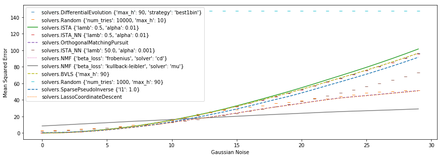

# Comparison of sparse coding algorithms

Authors: Joseph Paul Cohen, Shawn Tan, and Giancarlo Kerg. (Much of the source code comes from other sources)

Here there are implementations of the following methods:

- Random
- Iterative Shrinkage-Thresholding Algorithm (ISTA)
- Iterative Shrinkage-Thresholding Algorithm (ISTA) Non-Negative
- Orthogonal Matching Pursuit
- Lasso Coordinate Descent
- Non-Negative Least Squares
- Bounded-Variable Least-Squares
- Differential Evolution
- Non-negative Matrix Factorization (NMF)
- Sparse Pseudo Inverse

